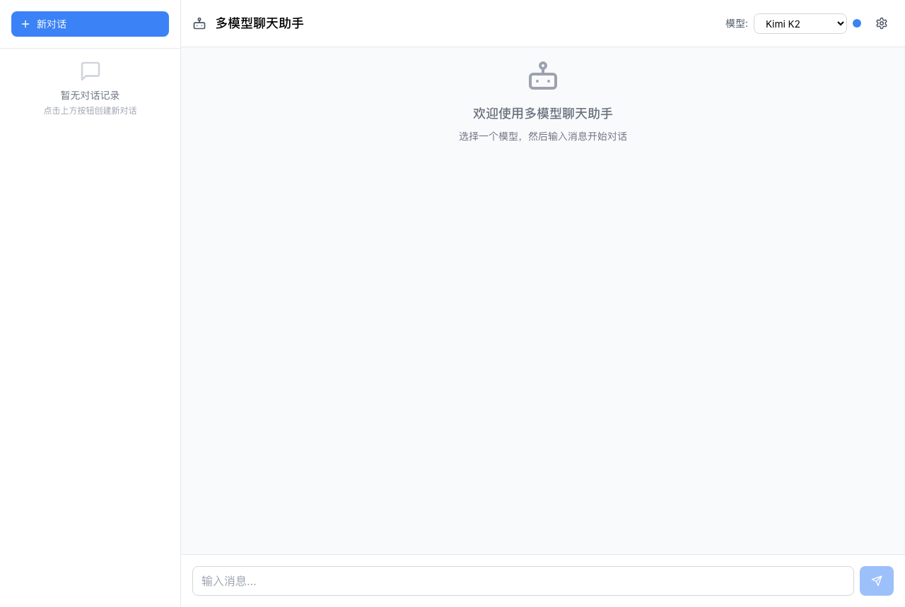

# Multi-Model AI Chat

A React chat application that switches between multiple large language models behind one interface, with streaming responses, conversation memory, and an accessible responsive UI.




*The model selector in the top right switches the backend without the rest of the UI changing. Note: the interface strings are currently Chinese only.*


## What it does

- **One abstraction over several model backends** — switch between Kimi K2 and DeepSeek R1 without the UI knowing which provider it is talking to. Endpoint, model name, token ceiling and temperature live in a single config map, so adding a provider is a config change rather than a code change.
- **Streaming responses** — tokens render as they arrive instead of waiting for the full completion.
- **Conversation memory** — full context is carried across turns; history is browsable and switchable in the side panel.
- **Failure handling** — error boundaries plus retry, request timeouts, and clear messaging when a key is rejected or a provider is slow.
- **Accessible and responsive** — keyboard navigation, screen-reader support, and layouts that work on desktop and mobile.
- **Keys stay local** — API keys are held in browser local storage and never leave the client.

## Architecture

```
src/
├── components/    UI components
├── hooks/         custom hooks
├── api/           provider layer — the abstraction that makes models interchangeable
├── types/         type definitions
├── constants/     model configuration
├── utils/         helpers
└── App.tsx        root component
```

Model parameters live in `src/constants/models.ts`:

```typescript
export const MODELS = {
  kimi: {
    name: 'Kimi K2',
    endpoint: 'https://api.moonshot.cn/v1/chat/completions',
    modelName: 'kimi-k2-0711-preview',
    maxTokens: 4000,
    temperature: 0.6
  },
  // ...
};
```

Longer design notes are in [ARCHITECTURE.md](./ARCHITECTURE.md).

## Supported models

| Model | Provider | Strengths | Good for |
|---|---|---|---|
| **Kimi K2** | Moonshot AI | Long-context understanding, strong Chinese | Document analysis, Chinese conversation |
| **DeepSeek R1** | DeepSeek | Strong reasoning, clear logical chains | Code, logical reasoning |

## Getting started

Requires Node.js >= 16 and npm >= 8.

```bash
git clone https://github.com/tianzhiliao/aichatbot.git
cd aichatbot
npm install
npm start
```

Then open [http://localhost:3000](http://localhost:3000).

On first run the app prompts for API keys — get them from [Moonshot AI](https://platform.moonshot.cn/) and [DeepSeek](https://platform.deepseek.com/). Keys are stored in browser local storage and can be changed later in settings.

Alternatively, create `.env.local`:

```bash
REACT_APP_KIMI_API_KEY=your_kimi_api_key_here
REACT_APP_DEEPSEEK_API_KEY=your_deepseek_api_key_here
```

## Keyboard shortcuts

| Key | Action |
|---|---|
| `Enter` | Send message |
| `Shift + Enter` | New line |
| `Ctrl/Cmd + K` | New conversation |
| `Escape` | Clear input |

## Build and deploy

```bash
npm run build     # production build into build/
```

The output is static and deploys to Vercel, Netlify, or any static host.

## Troubleshooting

| Symptom | Try |
|---|---|
| "API key invalid" or failed requests | Check the key is entered correctly, still valid, and has balance |
| Slow replies | Check the network, switch models, or shorten the input |
| Blank page | Clear browser cache, check the console, confirm Node.js >= 16 |

## License

MIT — see [LICENSE](LICENSE).

## Built with

[React](https://reactjs.org/) · [Tailwind CSS](https://tailwindcss.com/) · [Lucide React](https://lucide.dev/) · [Moonshot AI](https://www.moonshot.cn/) · [DeepSeek](https://www.deepseek.com/)

---

## 中文简介

一个 React 多模型聊天应用：在同一个界面下切换 Kimi K2 与 DeepSeek R1，支持流式响应、完整对话记忆、错误边界与重试、响应式与无障碍。

核心设计是 `api/` 这一层的**多模型抽象**——端点、模型名、token 上限、temperature 全部收在一份配置里，因此新增一个模型提供方是改配置而不是改代码。API 密钥只存在浏览器本地，不出客户端。

安装与使用见上方英文部分。
